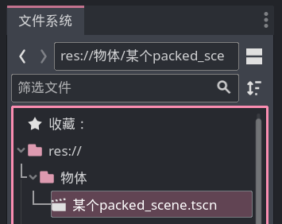

# PackedScene实例化

某些物品会在游戏中反复出现，以玩家发射的炮弹举例，炮弹可以被反复创建，且每颗炮弹都几乎相同，那么我们就可以制作一个炮弹模板，在玩家开火时创建它。

这个 `PackedScene` 就是模板，这俩单词翻译成中文是 `打包的场景`，也就是说模板的本质就是场景，也就是任意一个节点（及其子节点）。

> 如果学过 Unity，其实这个 PackedScene 就等于 Unity 的预制体。

## 创建 PackedScene

方法有三：

1. 点击菜单栏[场景] -> [新建场景]后，开始制作你的模板，并保存当前场景。

2. 在任意场景对着节点列表中的某个节点右键，点击 [将分支保存为场景]。

3. 在节点列表中拖拽节点到下面的文件列表中。

> Godot 中的一个场景就是个 PackedScene

## 生成 PackedScene

想要把一个 PackedScene 使用代码创建出来，就需要先在代码中获取到 PackedScene 这个文件。

使用 `load("文件路径")` 来读取一个 Godot 资源，这里的文件路径使用 `res://` 开头表示项目中的资源。

假如咱们把某个 PackedScene 保存到了项目中的 `物体` 文件夹，例如这样：



在代码中我们使用 `load("res://物体/某个packed_scene.tscn")` 即可获取到这个 PackedScene。

当我们想要根据这个 PackedScene 创建新物体时，可以调用它的 `instantiate` 方法，这个方法会返回创建好的节点。

现在我们来看下完整流程：

```gdscript
var 保存好的场景 = load("res://物体/某个packed_scene.tscn")
var 新物体 = 保存好的场景.instantiate()
get_parent().add_child(新物体)
```

最后一句的 `get_parent()` 会获取当前节点的父节点，然后我们又调用了父节点的 `add_child` 方法，`add_child` 方法会给节点添加新的子节点，所以最后这一整行就是把`新物体`变成了与代码所在节点自身同级的节点。

> [!tip] 
>
> instantiate() 只是把节点创建来出来，但还没有添加到场景中，所以是看不到的。
>
> 配合 add_child 才能真正创建一个新物体。

> [!tip]
>
> PackedScene 中的节点不能与外部的节点存在信号连接，比如 PackedScene 中某个按钮的信号不能连接到 PackedScene 外面的脚本上，毕竟在 Godot 眼中，她不知道这个 PackedScene 被创建出来的时候外面的脚本是否存在。
>
> 但是 PackedScene 内部的信号连接是没有问题的。