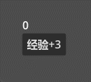

# 信号

有一种编程方式叫做“事件驱动式编程”，大意就是说当发生某件事的时候就执行一段代码，以此来实现整个程序的功能。其中的**事件**在 Godot 中被称作**信号**。

一个信号可以连接到很多方法，当信号触发时则会执行这些方法。

> 你也可以把信号理解成一组方法的集合，并且可以同时调用这组方法。

我们之前接触过按钮节点（Button）的 pressed 方法，这是按钮被按下的信号，不同的节点有不同的信号，例如输入框节点（LineEdit）有 text_changed 信号，会在内容发生变化时触发，且还包含一个参数。

## 连接信号

在 Godot 引擎界面中可以双击信号来连接到某个脚本上的方法，这种操作没什么难度，这里不再讲解。我们重点看看使用代码连接信号。

我们来尝试实现一个这样的效果：



场景中包含三个节点：

```
Control
    Button
    Label
```

我们将脚本写在了 Control 节点上：

```gdscript
extends Control

func _ready():
    $Button.pressed.connect(当点击按钮)

func 当点击按钮():
    $Label.text = str(int($Label.text) + 3)
```

重点就是 _ready 方法中的 `$Button.pressed.connect(当点击按钮)`，其中的 pressed 属性就是按钮的 pressed 信号，信号对象有 connect 方法，这个方法的参数也是一个方法，表示将信号连接到方法上。

> connect 这个单词的中文翻译：连接

## 断开连接

调用信号的 disconnect 方法就可以断开某个与方法的连接：

```gdscript
$Button.pressed.disconnect(当点击按钮)
```

> [!tip] 代码自动补全没了？
>
> 个人感觉目前的 Godot 编辑器有时候有点小问题，我的 Godot 在输入 `$Button.pressed.` 后不会弹出 pressed 的属性提示，这种情况对于新人来讲属于是个灾难。
>
> 这时候，强类型语法就可以登场了，可以用一些拐弯的方法来得到代码提示：
>
> ```gdscript
> var 点击信号: Signal = $Button.pressed
> 点击信号.connect(当点击按钮)
> ```
>
> 这样，在输入 `点击信号.` 的时候就能看到信号对象的代码提示了，这里使用的类型 Signal 就是信号类型。