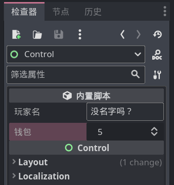

# 属性导出

选中一个节点后，我们可以在屏幕右边看到好多节点的属性，其实我们也可以在这里添加自己的属性。

给咱们脚本中的属性变量加上 `@export` 前缀即可：

```gdscript
@export var 玩家名: String = "没名字吗？"
@export var 钱包: int = 5

func _ready():
    # 注意，成员变量是指脚本最外层的变量，不要定义在方法里面！
    pass
```

给节点加上上面代码后，即可在属性面板看到效果：



定义变量时指定的初始值就是面板上的默认值，在面板上修改属性值后也就等于修改变量的值。大家可以修改后利用 print 语句试试效果。


> [!tip]
>
> Godot 会根据属性变量的类型提供不同的输入框，例如 Color 类型会提供颜色选择器，PackedScene 类型则会让你选择一个保存的场景。
>
> 很多时候，属性导出可以代替掉 load 方法。

> [!note]
>
> `@export var 哈` 这样的属性是不能导出的，因为 Godot 不知道这个变量是个什么类型，也就不知道应该在面板上显示什么样的输入框，所以这种属性变量必须使用强类型指定类型或指定上初始值。
