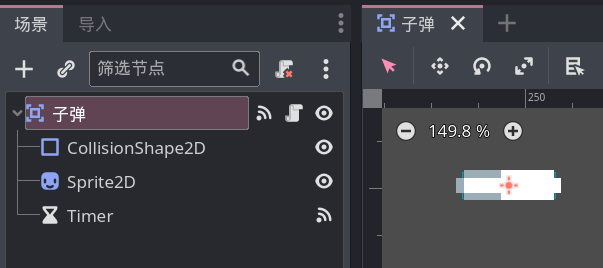
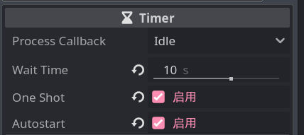

# 整活：Fire

本节实现玩家开火效果。

首先需要创建一个子弹的 PackedScene，由于玩家的子弹可以与其他物体产生碰撞，因此我们使用 Area2D 作为子弹的根结点：



> 最后那个 Timer 节点在本节最后讲解

子弹具有"飞行"能力，但飞行的方向是不固定的，需要根据玩家开火时的朝向确定，所以我们在子弹的代码中定义一个 `移动速度` 属性，当玩家发射子弹时由玩家来对这个属性赋值。

子弹的代码如下：

```gdscript
extends Area2D
class_name 子弹类

var 移动速度:Vector2

func _physics_process(delta):
    position += 移动速度 * delta
```

对应的，再给之前的玩家移动脚本添加上射击相关的逻辑：

```gdscript
var 子弹: PackedScene

func _ready():
    # 获取子弹的 PackedScene
    子弹 = load("res://子弹/子弹.tscn")

func _process(delta):
    var 鼠标方向 = get_global_mouse_position() - global_position
    rotation = 鼠标方向.angle()
    if Input.is_action_just_pressed("攻击"):
        var 创建的子弹:子弹类 = 子弹.instantiate()
        创建的子弹.移动速度 = 鼠标方向.normalized() * 1000
        $"/root/".add_child(创建的子弹)
        创建的子弹.global_position = global_position
        创建的子弹.rotation = 鼠标方向.angle()
```

> `鼠标方向.normalized()` 可以把向量归一化，以此来去除鼠标位置对子弹速度的影响。

## 子弹清理

> [!tip]
>
> 涉及到信号指示，可以先阅读 [信号](./信号.md) 章节。

如果你发射了太多子弹，例如100000发，当子弹飞出屏幕后，即便我们再也见不到它，但它仍然在我们的视野之外飞行，这会对电脑产生不小的压力。

因此我们需要删除掉一些"没有用"的子弹，这里我给子弹添加了一个定时器节点（Timer 节点），它将在子弹被创建的 10 秒后触发 timeout 信号：



将 timeout 信号连接到子弹脚本中即可实现定时删除：

```gdscript
func _on_timer_timeout():
    queue_free()
```

> [!tip]
>
> 根据时间清理子弹不是唯一的手段，例如还可以根据子弹的位置来清理，或是子弹的移动距离等，你可以试着自己实现下其他的清理方式。