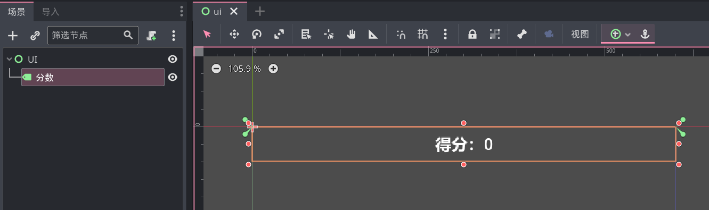

# 整活：分数

我们可以让游戏更有趣一些，让玩家在击中靶子时增加一些分数，且不同的靶子分数不同。

首先实现一点：不同靶子分数不同。现在给靶子添加一个脚本，脚本中仅需要一句代码：

```gdscript
@export var 分数: int = 1
```

这样，当我们创建多个靶子时（建议用 PackedScene），即可在引擎中任意修改某一个靶子的分数了。

通常在一个完整的游戏中会有单独的部分存储全局信息，但我们的游戏比较简单，我就将分数变量存放到玩家实例上了，也就是给玩家添加一个属性：

```gdscript
var 分数: int = 0
```

为了显示分数，我们在创建几个节点来组成 ui 界面：



把上述 ui 节点添加到场景中后，接着修改子弹击中靶子后的代码：

```gdscript
if body.is_in_group("靶子"):
    # 玩家的现有分数加上靶子的价值分数
    $"/root/Game/玩家".分数 += body.分数
    
    # 更新 ui 界面
    $"/root/Game/UI/分数".text = "得分：" + str($"/root/Game/玩家".分数)

    body.queue_free()
    queue_free()
```

完成