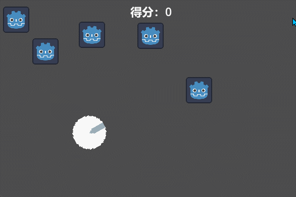
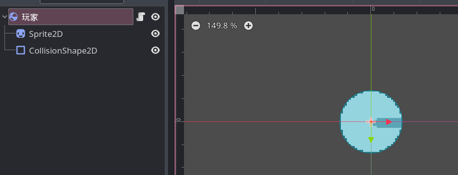

# 整活：玩家移动

终于来到了一个整活章节，本章的整活章节将共同制作一个小游戏，玩起来大概这样：



本节咱们运用刚刚学习过的生命周期方法和获取输入来实现玩家的移动。

## 玩家节点创建

我们的主角需要具有上下左右移动的能力，并且我们不希望他能穿透障碍，因此我们选择 `RigidBody2D` 作为玩家的根节点，子节点则是玩家的碰撞体和显示玩家图片用的精灵：



此时需要注意以下几点：

- Godot 中的 0 度表示向右，因此这里的玩家默认向右看。

- 咱的游戏是俯视视角的，而 Godot 的 RigidBody2D 节点自带一个向下的重力，因此需要给 RigidBody2D 的 GravityScale 属性设置为 0 以取消重力。

- CollisionShape2D 节点需要指定一个碰撞形状，也就是 Shape 属性，这里使用的是 CircleShape2D 形状，如果你还不太了解这些节点的使用，可以自己试着多点一点，界面操作肯定是比学习代码简单的。

## 代码编写

移动玩家的代码肯定是要写在玩家最外层的节点了，具体的代码如下：

```gdscript
extends RigidBody2D

var 移动速度: int = 200

func _physics_process(delta):
    var 移动输入 := Input.get_vector("左", "右", "上", "下")
    if 移动输入.length() > 0:
        move_and_collide(移动输入 * delta * 移动速度)

func _process(delta):
    var 鼠标方向 = get_global_mouse_position() - global_position
    rotation = 鼠标方向.angle()
```

其中 `_physics_process` 方法中先获取了玩家移动的按键输入，并保存到一个二维向量中，若该向量的长度为 0，则表示玩家没有输入，所以当输入不为 0 时调用 `move_and_collide` 方法进行移动。

`_process` 方法中使用 `get_global_mouse_position` 方法获取鼠标的坐标，并减去当前玩家的全局坐标，这样就得到了一个从玩家指向鼠标的方向向量，并存放到 `鼠标方向` 变量中。随后将这个方向的角度赋值给玩家的旋转角度（rotation 变量）。

> [!tip]
>
> 移动行为涉及到障碍物碰撞等物理效果，所以移动逻辑被放在了 `_physics_process` 方法中，而在本游戏中的玩家旋转行为不涉及物理效果，所以放在了 `_process` 方法中，当你在制作自己的游戏时需要根据游戏需求选择不同的生命周期方法。

> [!tip]
>
> 思考一个小问题，现在的玩家垂直向下的移动速度和向右下方斜向移动的速度相同吗？尝试使用 `print(移动输入)` 看一看吧。