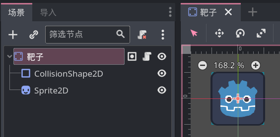

# 整活：靶子

本节来添加靶子，这是一个可以被子弹攻击到的物体，并且会阻碍玩家移动，因此使用 StaticBody2D 作为靶子的根结点：



靶子的唯一用途就是被子弹攻击，因此靶子自身不用编写任何方法。

要做到子弹攻击靶子，我们需要修改子弹脚本，利用子弹根结点 Area2D 的 `body_entered` 信号，我们可以在子弹碰到某个物理节点（例如 StaticBody2D）时做一些处理。

连接子弹根结点的 `body_entered` 信号到子弹脚本上，并且写下如下代码：

```gdscript
func _on_body_entered(body:PhysicsBody2D):
    if body.is_in_group("靶子"):
        body.queue_free()
        queue_free()
```

其中的第一个 if 判断碰到的节点是否在 `靶子` 组中，所以不要忘了给靶子节点添加到这个组中。if 里面的两行代码就分别是删除靶子和子弹。

> [!tip]
>
> 我们也可以选择在靶子上编写逻辑，进行"靶子是否碰到子弹"的判断，但一般我们的认知应该是"子弹攻击靶子"，所以我习惯把这个判定放到子弹身上。