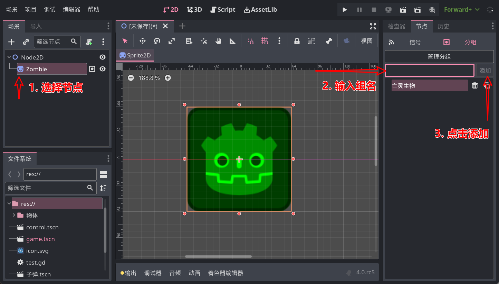

# 组

Godot 中的组，作用是给节点打标签。

在游戏中，某些东西会被归为一类，例如 Minecraft 中的僵尸和骷髅是“亡灵生物”，蜘蛛和烈焰人是“节肢生物”，在使用高级的武器攻击它们时会产生不同的效果。对于代码来讲，当武器击中怪物时就需要判断敌人的种类，从而造成不同的伤害。

选中一个节点后，在屏幕右边的**节点**选项卡的**分组**页面中即可给节点分配组，例如现在创建一个僵尸节点：



这样，节点就加入了一个组。

> 组不用手动创建，但如果你想要更好的管理组，可以试试点**管理分组**按钮。

## 判断组

来到代码中，我们可以使用节点对象的 `is_in_group` 方法判断节点是否属于某个组，例如在刚刚的场景中，我们在根节点中加入下面代码：

```gdscript
func _ready():
    print($Zombie.is_in_group("亡灵生物"))
```

这就会输出一个 `true`。

## 代码操作组

虽然应该不常用，但如果你想要使用代码操纵节点的组，可以使用 `add_to_group` 方法把节点添加到一个组中，或使用 `remove_from_group` 从组中移除节点：

```gdscript
$Zombie.remove_from_group("亡灵生物")
$Zombie.add_to_group("怪物")
print($Zombie.is_in_group("亡灵生物")) # 输出 false
print($Zombie.is_in_group("怪物")) # 输出 true
```

还有个 `get_groups` 方法可以获取节点的全部组，考虑到一般用不到，此处不再展示。