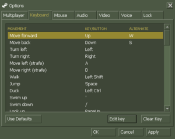
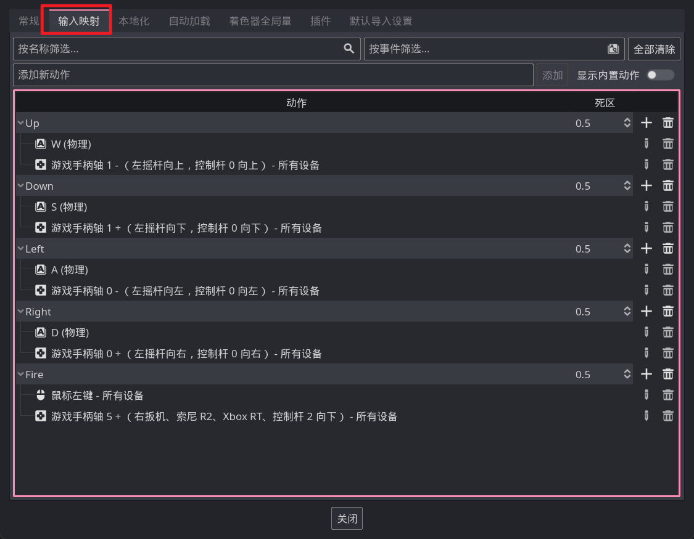

# 获取输入

Godot 给我们预先写好了很多类，这其中有一个 `Input` 类专门用于获取玩家的输入信息。

先来介绍一个最简单的方法，`is_key_pressed`，它可以判断一个按键是否被按住，例如实现一个按 w 键向上移动：

```gdscript
func _physics_process(delta):
    if Input.is_key_pressed(KEY_W):
        position.y -= 1000 * delta
```

因为涉及到移动，所以我们把这段代码放到了 `_physics_process` 生命周期方法中。

根据 `is_key_pressed` 这个名字可以看出来，他是判断按键是否被按下的，也就是说这个方法的返回值是布尔类型，当按键被按下时返回 true，没按下时返回 false。它的参数是一个 KeyCode 类型的枚举，什么是枚举可以先不用考虑，总之这个参数应该是你想检测的按键，而 Godot 定义了一堆 `KEY_???` 这样的变量来表示每一个按键，上面代码中使用的 `KEY_W` 就表示了键盘上的 W 键。

`is_key_pressed` 结合 `if` 语句，就实现了**当玩家按下某个键时执行一段代码**这样的逻辑，这里当按下 W 时就会执行向上移动，也就是 `position.y -= 1000 * delta`。

> 关于 position 和 delta 分别在 [生命周期2](/Part-引擎交互/生命周期2.md#delta) 和 [类成员](/Part-认识面向对象/类成员.md#对象的属性还是对象) 小节讲过。

## 输入映射

大部分游戏都支持多种输入方式，例如一般的主机游戏都支持键鼠和手柄，虽然我们可以使用 or 运算同时判断多个按键输入，但这必定会很麻烦。

现在的绝大多数游戏都会有一个这样的界面：



在这种地方，游戏定义了例如移动、跳跃等动作。在代码中直接判断玩家是否进行了某种动作即可，Godot 也为我们提供了一个这样的东西。

打开引擎主界面菜单中的`项目` -> `项目设置` -> `输入映射` 选项卡，即可看到类似上图的界面，我们可以在这里添加咱们的按键映射，例如：



在代码中，我们可以使用 `Input.is_action_pressed("动作名称")` 来获取某个动作对应的按键是否被按下，例如我们要检测上图中的 Fire 动作：

```gdscript
if Input.is_action_pressed("Fire"):
    print("按下了 Fire 键！")
```
