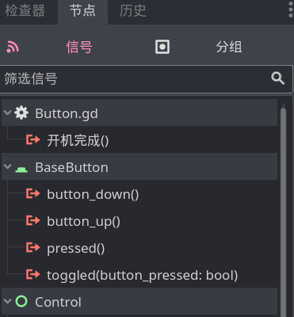

# 信号

信号这个东西我相信大家已经能够熟练运用了，但我们一直都在使用 Godot 节点给我们提供的信号。现在我们要定义我们自己的信号了。

信号类似属性和方法，也属于类成员，在脚本中使用 `signal` 关键字定义信号，具体格式和定义方法差不多：

```
signal <信号名>([参数列表])
```

例如我们给手机类定义一个 `开机完成` 方法：

```gdscript
signal 开机完成()
```

然后把手机脚本放到节点上，就能在这个节点的列表中看到这个信号了：



## 触发信号

信号需要手动触发，使用 `emit` 方法：

```gdscript
func 开机():
    print("加载中...")
    已经开机 = true
    print("开机完成")
    开机完成.emit()
```

## 带参数的信号

例如咱们再做一个发送短信的信号：

```gdscript
signal 发送短信完成(目标号码:String, 短信内容:String)

func 发短信(电话号码:String, 短信内容:String):
    if 已经开机:
        print("给 " + 电话号码 + " 发信息，内容如下：" + 短信内容)
        发送短信完成.emit(电话号码, 短信内容)
```

> [!note] 不可滥用信号
>
> 信号可以向外界反应自身的状态，但这不是节点之间的唯一通信途径，别忘了我们可以直接使用 `<节点变量>.属性或方法` 这种形式修改其他节点的属性或是调用其他节点的方法。
