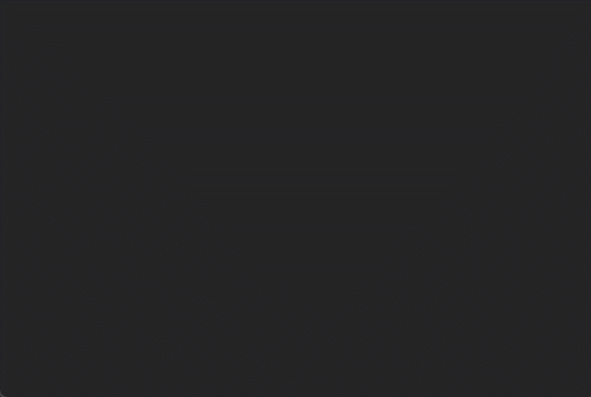
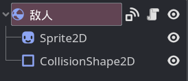

# 整活：敌人

本章节的整活部分将在上一章的结果上，做出这样一个东西：



> 在这个游戏中，玩家可以切换两种武器攻击敌人，敌人则会一直追着玩家，敌人接触玩家会让玩家受到伤害。
>
> 屏幕左上角可以看到玩家的血量和使用的武器。

## 敌人节点

本节来实现敌人，敌人作为一个会移动的物体，使用 `RigidBody2D` 作为根节点：



## 敌人移动

敌人的移动逻辑很简单，就是一直向玩家方向跑过去。

所以第一步是需要获取到玩家节点：

```gdscript
var 目标:RigidBody2D

func _ready():
    目标 = $"/root/Game/玩家"
```

接着，只需要在 `_physics_process` 方法中不断向玩家移动即可：

```gdscript
@export var 移动速度:float = 300

func _physics_process(delta):
    var 移动方向 = (目标.global_position - global_position).normalized()
    move_and_collide(移动方向 * 移动速度 * delta)
```

## 敌人受击

敌人会被玩家用子弹攻击，所以我们可以给敌人定义一个血量变量和一个受到攻击的方法：

```gdscript
var 生命值:int = 10

func 受伤(伤害:int):
    生命值 -= 伤害
    if 生命值 <= 0:
        queue_free()
```

接着修改子弹的代码：

```gdscript
func _on_body_entered(body:PhysicsBody2D):
    # 给敌人节点添加到“敌人”组中。
    if body.is_in_group("敌人"):
        body.受伤(4) # 对敌人造成 4 点伤害
        queue_free()
```

在场景中放几个敌人，运行游戏试试吧。