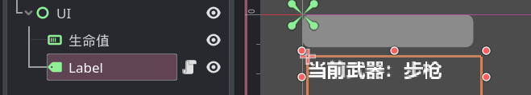

# 整活：更换武器的UI提示

首先先加一个 Label 节点来显示玩家当前的武器：



## 玩家的代码

首先，我们给玩家的定义一个切换武器信号：

```gdscript
signal 更换武器(武器名:String)
```

并在切换武器时触发这个信号：

```gdscript
if Input.is_action_just_pressed("武器1"):
    切换武器(load("res://武器/步枪.tscn"))
    更换武器.emit("步枪")
if Input.is_action_just_pressed("武器2"):
    切换武器(load("res://武器/霰弹.tscn"))
    更换武器.emit("霰弹")
```

接着我们就可以给这个显示武器的 Label 添加上这样的脚本：

```gdscript
extends Label

func _ready():
    $"/root/Game/玩家".更换武器.connect(修改武器名)

func 修改武器名(名称):
    text = "当前武器：" + name
```