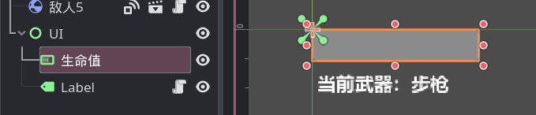

# 整活：玩家生命值

本节来给玩家加上生命值，当被敌人摸到的时候减血。

## 玩家代码

首先第一件事是给玩家定义一个生命值属性：

```gdscript
var 生命值:int = 100 : 
    set(value):
        生命值 = value
        $"/root/Game/UI/生命值".value = 生命值
```

> 此处对 `生命值` 进行了封装，当设置生命值的时候也会同时修改游戏的 UI。

## 生命值 UI

生命值 UI 使用了一个 ProgressBar 节点，这个节点会显示一个进度条，并通过 value 属性控制进度条的进度，默认情况下 value 的取值范围是 0 ~ 100，咱默认给它一个 100 即可。



> 别忘了玩家的 `生命值` 属性有个 set 封装，在封装代码中引用了这个 UI 节点，并在修改 `生命值` 时修改进度条的值。

## 敌人攻击玩家

目前的游戏逻辑是，当敌人碰到玩家时，不断对玩家造成 1 点伤害。

回到敌人节点上，敌人的根节点 RigidBody2D 拥有两个信号：`body_entered` 和 `body_exited`，这两个信号会在敌人接触到另一个 RigidBody 和离开另一个 RigidBody 时触发，所以下面这段代码可以将“是否碰到玩家”这个值记录在变量 `接触玩家` 中：

```gdscript
var 接触玩家 = false

func _on_body_exited(body:Node):
    if body == 目标:
        接触玩家 = false

func _on_body_entered(body:Node):
    if body == 目标:
        接触玩家 = true
```

接着，在敌人的 `_physics_process` 方法中，根据 `接触玩家` 变量来对玩家造成伤害即可：

```gdscript
if 接触玩家:
    目标.生命值 -= 1
```

## RigidBody2D 节点设置

此时如果运行游戏，其实并不会有攻击效果，此处还需要对敌人的 RigidBody2D 节点做下设置：

1. 启用 Contact Monitor 属性

2. 修改 Max Contacts Reported 使其大于 0，此处我用了 10。

> 其中 Contact Monitor 属性控制了能否触发 `body_entered` 和 `body_exited` 信号。