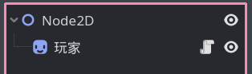
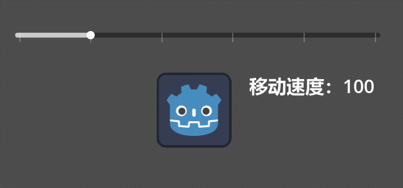

# 脚本与类

回想之前，我们学习过类的基本概念，如果印象不太清晰的话可以回看 [认识面向对象](../Part-认识面向对象/Start.md) 章节。

当时我们说过，写在节点上的脚本就是一个类，我们使用一个让玩家左右移动的脚本作为例子：

```gdscript
extends Node2D

var 移动速度: int = 100

func _physics_process(delta):
    var 移动 := 获取横向移动()
    if 移动 != 0:
        position.x += 移动 * delta * 移动速度

func 获取横向移动() -> int:
    if Input.is_action_pressed("Left"):
        return -1
    if Input.is_action_pressed("Right"):
        return 1
    return 0
```

上述代码就是一个类，这个类中声明了一个 `移动速度` 属性和 `获取横向速度` 方法，并在 `_physics_process` 方法中实现了左右移动的逻辑。

我们现在把这个脚本放到一个节点上，构成这样的场景：



现在我们来实现一个效果：



如上图，我们可以使用一个滑动条来修改玩家速度，按照传统做法，我们可以把滑动条的数值更改信号 `value_changed` 连接到玩家脚本上的某个方法，并在其中修改玩家的 `移动速度` 属性。

但在复杂的游戏中，可能有多种因素影响玩家的移动速度，例如 游戏的地形、玩家负重、负面效果 等，如果都使用信号连接那肯定会特别麻烦，因此我们需要尝试一种直接修改玩家移动速度的方法。

现在我复制一段第二章中“变量”小节中的一句话：**当变量放在方法外面，表示这个变量属于当前节点**。现在我们知道这样的变量就是属性，但注意**这个变量属于当前节点**这几个字，这就表示，当其他的代码获取到玩家节点时，就可以通过这个节点直接访问这个变量，例如：

```gdscript
$"/root/玩家".移动速度 = 300
```

这样就可以修改玩家的移动速度了。

> [!tip]
> 
> 讲了半天就是说，`节点.属性` 这种语法也可以引用到咱们自己定义的属性变量。

现在来实现上图中的效果，我把代码写在了根节点上，滑动条的 `value_changed` 信号连接的方法如下：

```gdscript
func _on_h_slider_value_changed(value):
    $"玩家".移动速度 = value
    $Label.text = "移动速度：" + str(value)
```

同理，我们在节点上定义的方法也可以被上述方式访问：

```gdscript
$"/root/玩家".获取横向移动()
```

## 命名类

我说咱的脚本就是类，可我们接触过的类都有一个名字对吧，比如 `Input` 是类名，`LineEdit` 是类名，那我们的类是什么名字？

很明显，咱的类目前还没有名字，但我们可以通过 `class_name` 关键字指定一个名字，只需要在方法外面（与属性同级）的地方写上 `class_name <类名>` 即可，例如：

```gdscript
extends Node2D
class_name 玩家移动控制器

var 移动速度: int = 100

func _physics_process(delta):
    var 移动 := 获取横向移动()
    if 移动 != 0:
        position.x += 移动 * delta * 移动速度

func 获取横向移动() -> int:
    if Input.is_action_pressed("Left"):
        return -1
    if Input.is_action_pressed("Right"):
        return 1
    return 0
```

拥有类名后就可以与强类型变量使用了，例如 `var 玩家: 玩家移动控制器 = $"/root/玩家"`。
