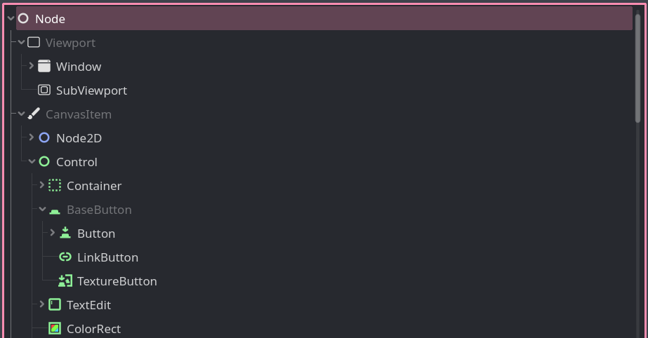
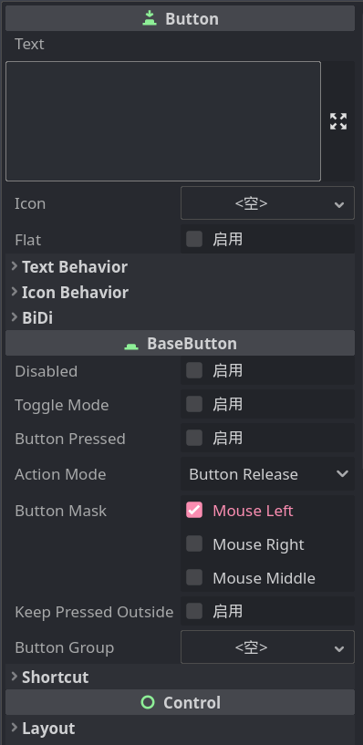

# 节点与继承

每次添加新节点，都能看到这样的界面：

这些节点类型之间呈现出一种树状结构，层层递进，这样布局是怎么来的呢？

我们用 Button 节点举例，它的完整位置在 `Node -> CanvasItem -> Control -> BaseButton -> Button` ，开头的 Node 表示这是个节点，CanvasItem 表示这是一个 2D 绘制节点，Control 表示 UI 节点，然后就是 Button 按钮节点。

现在添加一个 Button 到场景中，我们能看到它的属性列表如下：

从上向下，我们会发现这些属性分成了 Button、BaseButton、Control、CanvasItem、Node 这几组，很明显这就是 Button 节点在节点列表中的路径倒序。

结合本节标题，你应该也猜到了，Button 类正是继承自这些父类节点而来，所以我们可以在 Button 节点上看到 Control、Node 等父类的属性。同理，其他节点也相同。

## 脚本的继承

思考我们曾经写过的代码：`position.x += 10`，这里的 position 属性来自哪里呢？没错，就是继承自父类的。

每个脚本的开头，Godot 都会给我们生成一行继承语句，继承的父类通常是脚本所绑定到的节点类型。

根据所学，继承可以给原有的类增加功能，所以当我们的脚本继承自某个节点类时，我们**实际上就是在一种节点的基础上创造了一种新的节点**，并添加了我们的功能，例如玩家移动等效果。

> [!tip]
>
> 我们的脚本并不一定需要继承自这个节点本身的类型，也可以是它的父类，例如我们只是希望调整按钮的位置，那么我们可以继承 Control 类，这样这个调整位置的脚本就可以用在所有 Control 的子类类型的节点上。