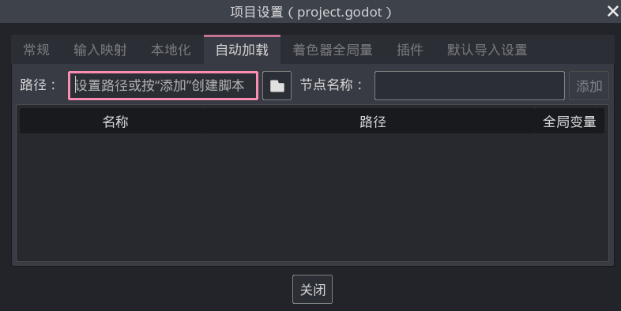
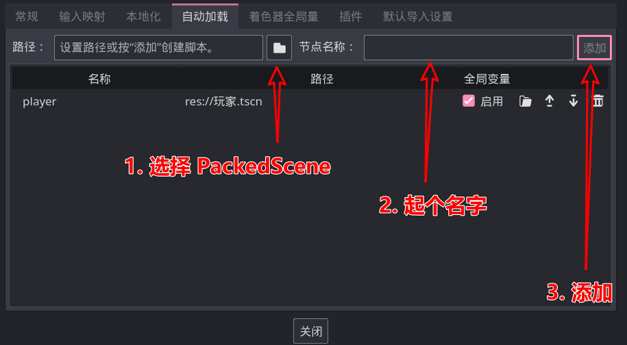

# 单例/自动加载

我们的游戏经常需要有个地方存放一些全局性的信息，例如游戏的版本、当前游戏时间等，通常我们会单独制作一个节点来存放这些信息。

这就引出了一个问题，这个全局信息节点由谁来创建呢？首先排除手动创建，大家心里要明白当 Godot 自己不出问题时最容易出问题的东西就是人，所以 Godot 给咱提供了自动创建功能。

现在打开菜单栏中【项目】【项目设置】界面，点击其中的【自动加载】选项卡即可看到：



在最上面的路径中填写需要被加载的 PackedScene 路径或点击后面的文件夹按钮来选择一个 PackedScene 后，再给它起个名字即可点击最后的添加按钮：



同时注意自动加载列表中有一个全局变量按钮，当勾选了这个东西时即可在代码中的任意位置通过前面的名称使用这个节点或脚本的实例，例如现在在任意代码处即可使用：

```gdscript
print(player.global_position)
```

> 如果你学过其他编程语言中的设计模式，就会明白“自动加载”就是起到了单例模式的作用。
