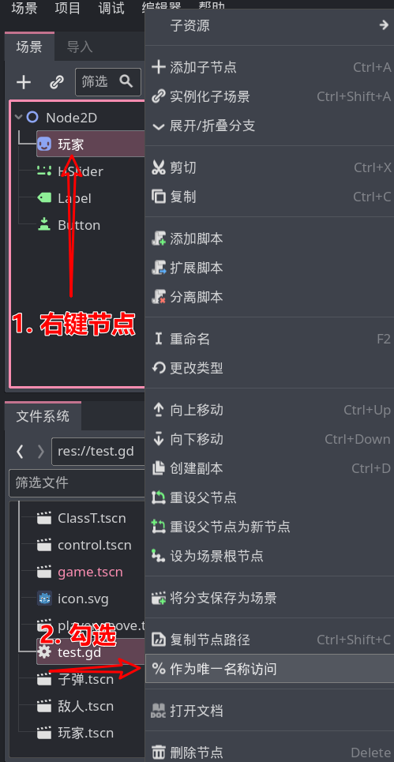

# 唯一名称

某些节点需要在其他位置反复通过 `$"XXX"` 语法访问，这时候 $ 符号后面长长的路径就会成为累赘。

如果这个节点的名称在场景中是唯一的，那么就可以给这个节点勾选上 唯一名称：

此时即可在代码中通过 `%"节点的唯一名称"` 语法来获取这个节点，在这种语法中就只填写节点名即可，不需要节点的路径。

> 如果节点名称没有空格或者其他特殊符号、没有造成语法歧义的话，可以去除引号，也就是 `%节点的唯一名称`。

> [!note]
> 
> 注意，不是不重名就可以用 % 符号获取，一定不要忘记给节点标记上 唯一名称。
