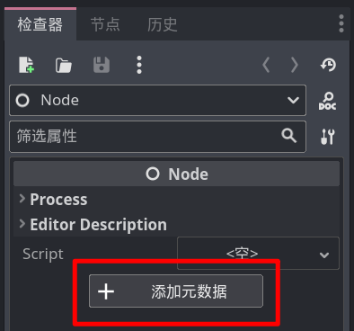
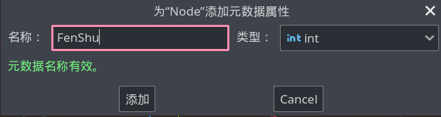

# 存档与读档

Godot 拥有对 Json 数据的完美支持，如果你学习过 Json，可以尝试使用 Json 保存游戏存档。

但面对零基础的新人，我会介绍一种纯 Godot 的数据保存方式。

## 元数据

我们在场景编辑器中，选中任意一个节点后，即可在引擎最右边看到属性面板，这个面板最下面有一个“添加元数据”按钮：



所谓的元数据，你可以理解成给节点添加一些额外的信息，这些信息类似属性，也是由名称和值来表示的，点击添加元数据按钮后，即可看到一个元数据设置节点，只要在这里填入数据名和值的类型即可，例如咱们现在来存储一下玩家的分数：



> 截止至 4.0.1 版本，元数据名称不支持中文。

点击添加后，在属性列表的最下方即可看到这个分数字段，并且可以修改数值。

## 打包节点

本节讲的是存档，为什么我要先讲元数据呢，因为咱们 Godot 给咱提供了一种方法，可以将一个节点保存成文件，这个文件中自然也就包含元数据。

保存节点其实很简单，本质上就是利用了 PackedScene，不过我们之前都是通过 load 方法或 @export 属性来获取项目中已经存在的 PackedScene，而现在，咱们要凭空创造一个 PackedScene。

创造 PackedScene 很简单，只需要先实例化一个 PackedScene 实例，并调用它的 pack 方法即可：

```gdscript
var 打包包 := PackedScene.new()
打包包.pack(被打包的节点)
```

这个 pack 方法就是将某个节点放到这个 PackedScene 中，所以结合上面的节点元数据，我们就能把分数信息保存到一个 PackedScene 中了：

```gdscript
var 节点 := Node.new()
# set_meta 就是添加一条元数据
节点.set_meta("分数", 123)

var 打包包 := PackedScene.new()
打包包.pack(节点)
```

> [!tip] 不需要 add_child
>
> 此处的 Node 节点只是存个数据，不需要添加到场景中去。

## 保存资源

接下来只剩下最后一步了，只要将 PackedScene 保存成文件即可，这需要使用 `ResourceSaver.save` 方法：

```gdscript
ResourceSaver.save(打包包, "user://存档.tscn")
```

这样，那个包含分数元数据的Node就被以 PackedScene 的方式保存到用户目录的 存档.tscn 文件中了。

完整的代码如下：

```gdscript
var 节点 := Node.new()
# set_meta 就是添加一条元数据
节点.set_meta("分数", 123)

var 打包包 := PackedScene.new()
打包包.pack(节点)

ResourceSaver.save(打包包, "user://存档.tscn")

# 删除这个用完了的节点
节点.free()
```

> [!warning] 不要保存引用
>
> 不要保存任何实例的引用，在读取时这些引用都会失效。
>
> 建议只保存值类型数据，例如 数字、字符串、Vector3、Color 等。

## 读取存档

因为咱们保存的是个 PackedScene，所以读取存档就是实例化 PackedScene：

```gdscript
var 节点 = load("user://存档.tscn").instantiate()
# 显示之前保存的分数
print(节点.get_meta("分数"))
节点.free()
```