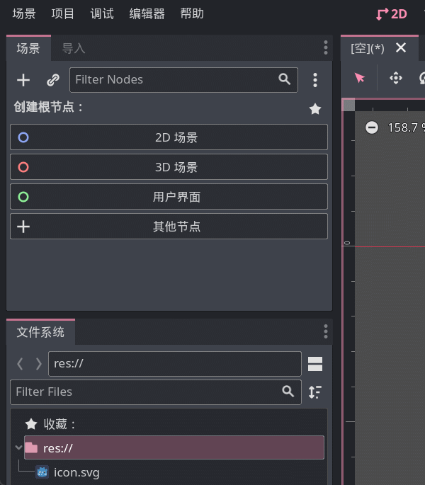

# 第一句代码

如果你就算只碰过一点点编程，应该也会见过这么一句话：

```gdscript
"Hello, World!"
```

这是计算机行业的元老级 meme 之一，当人们在学习一门新编程语言时，就会想办法让那个语言把上面这几个字母显示在屏幕上。

这时你可以打开 Godot，创建一个 Label，然后在 text 属性中写上 `Hello, World!`，运行后（或许不用运行）就会看到屏幕上出现了这几个字母，恭喜，你学会 GDScript了！


等等，那说好的代码呢？

~~很明显上面是一些玩笑话~~，但我建议你还是尝试一编上面的步骤，毕竟你是一位要成为*边城带师*的人，这种点点鼠标的操作还是要熟练掌握才行的
。

> 本文重点在 GDScript，不会涉及太多的引擎操作知识，如果你还不会引擎的基本操作，建议打开 Godot 到处点一点，很快你就会熟悉她的界面逻辑了。

> 给纯新人小伙伴的一个建议：放纵自己的好奇心，对感兴趣的东西先动手尝试再寻求帮助更好。

## print

下面我来带大家用代码的方式显示一句话。

首先我们要明白 Godot 中构成游戏的基本单位是`节点`，也就是默认界面左上角的那些东西。我们写的代码被称作`脚本`（不是玩游戏开挂的那个脚本哈），每个节点可以绑定一个脚本来扩展节点的功能，因此想执行咱自己的代码，第一步就是要有一个节点。

目前随便创建一个节点即可，然后选中节点，点击添加脚本按钮：



在最后出现的窗口中，是对这个新脚本的设置，建议勾上`内置脚本`选项，其余目前不用改，接着点击`创建`即可。

接着咱就被带到了一个代码编辑器中，看起来应该是这样：

```gdscript
extends Control

# Called when the node enters the scene tree for the first time.
func _ready():
    pass # Replace with function body.

# Called every frame. 'delta' is the elapsed time since the previous frame.
func _process(delta):
    pass
```

> 第一行可能不太一样，这取决于刚刚创建的节点是什么类型。

现在目标聚焦 `func _ready():` 这一行，在这一行的最后咱们加一个回车，然后输入 `print("Hello, World!")`，完事后这一段应该是下面这个样子：

```gdscript
func _ready():
    print("Hello, World!")
    pass
```

> [!tip]
>
> 注意不要改动其他地方的代码，上面我放了三行代码只是完整代码的一部分，因为每次都贴完整代码太长了，所以我就省略了其他部分，但你不要省略。

注意 `print` 的前面应该是一个制表符，Godot 应该会自动帮你加上，如果你发现 `print` 和下面的 `pass` 没有垂直对齐，可能需要手动在前面输入一个制表符（按Tab键输入）。

接下来，保存场景、运行游戏，发动你的火眼金晶在屏幕上找到 `Hello, World!` 吧！


恭喜你已经成功运行了第一句 GDScript 代码！

> [!warning] 常见问题
>
> 1. 在编程时我们要保证自己的输入法处于英文状态，一般的编程语言不认识中文符号，看看你 print 后面的括号和双引号是英文的吗？
>
> 2. `Hello, World!` 两边的双引号在这里表示**中间夹着一段文字**，因此不要省略这俩双引号！
>
> 3. 运行的场景要选择当前编写代码的场景，不要运行错了场景。（可以点击F6直接运行当前场景）
>
> ... 更多问题等待你的反馈，我会在这里解答

> [!note]
>
> print 这句话的功能其实就是在 Godot 引擎界面中显示一些东西，虽然玩家看不到，但对于我们开发者来讲通常会利用 print 进行一些排错工作，起到类似于日志的作用。
