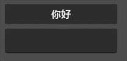
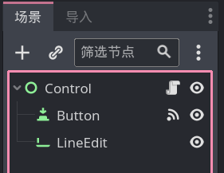
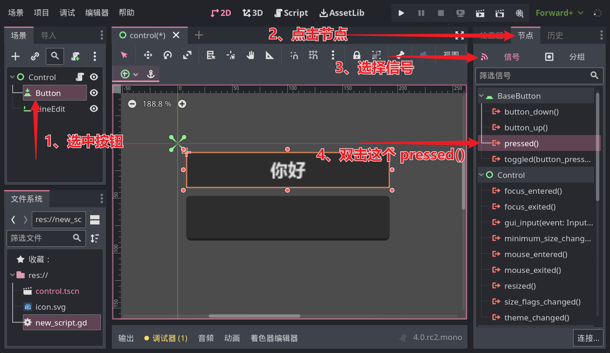
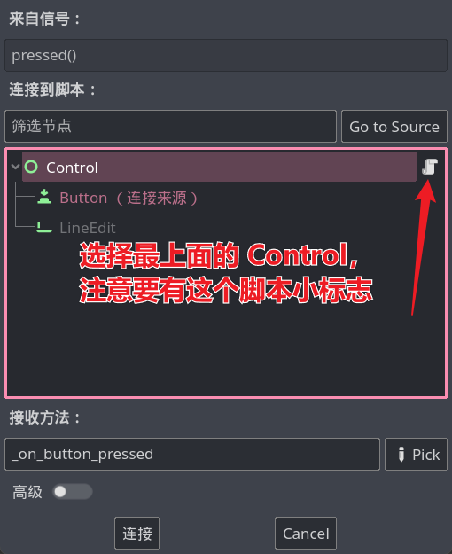

# 整活：你好XXX

经历了枯燥的变量、数据类型、运算符的学习，欢迎来到第一个整活章节。

哈哈，也不要以为整活章节就不用学东西了，毕竟想一想，就目前学的 GDScript 能整什么活呢？

所以在整活章节中，我们需要学习 GDScript 操作 Godot 游戏的方法，这一节咱们实现这样一个功能：



这里有一个按钮和一个输入框，点击按钮后，按钮上就会显示 `你好：<输入的内容>` 这句问候。

## 场景创建

场景很简单，共有三个节点：



添加好后调整它们的位置即可，怎么摆放大家随心即可。

接下来给最外层的 Control 节点添加一个内置脚本，暂时不需要修改里面的内容。

然后关键步骤来了，选中按钮，接着点击引擎右边的 `节点` 选项卡，进入 `信号` 列表，找到其中的 `pressed()` 并双击：



然后就会看到一个弹窗，在窗口中选中添加了脚本的 Control 节点并点击连接



然后我们的脚本中就会多出一个 `_on_button_pressed` 方法，应该长这样：

```gdscript
func _on_button_pressed():
    pass # Replace with function body.
```

## 解读

当按钮被点击时，就会发出 `pressed` 信号，而现在按钮的 `pressed` 信号连接了脚本中的 `_on_button_pressed` 方法，就意味着点击按钮就会执行这个方法，你可以在方法中先写一句 print 试试。

## 获取输入

我们接下来需要获取玩家的输入，因此就要先找到输入框节点，获取节点的语法是这样的：

```
$<节点路径>
```

目前输入框的节点路径就是他的名字，所以咱可以在 `_on_button_pressed` 方法中写下：

```gdscript
var 输入框: LineEdit = $LineEdit
var 按钮: Button = $Button # 顺手把按钮也拿到
```

> [!tip]
> 
> `LineEdit` 和 `Button` 是节点的类型，这些节点类型也是一种数据类型，可以用在强类型语法中。

> [!tip]
> 
> `$` 语法本质上是一种简写，它的完整写法是一个方法调用，写做 `get_node("节点路径")`，不过还是 `$` 写法更简单实用。

输入框节点的 text 属性表示输入的值，通过一个小数点的点 `.`，可以从节点中获取属性，所以：

```gdscript
var 输入值: String = 输入框.text
```

按钮的显示文字也是 text 属性控制的，所以把这个输入值加上前缀，再交给按钮的 text 就完成这节整活了。

```gdscript
按钮.text = "你好：" + 输入值
```

最终的完整方法应该长这样：

```gdscript
func _on_button_pressed():
    var 输入框: LineEdit = $LineEdit
    var 按钮: Button = $Button # 顺手把按钮也拿到
    var 输入值: String = 输入框.text
    按钮.text = "你好：" + 输入值
```

> [!tip]
> 
> 文中代码使用了强类型语法，也可以不使用，但推荐加上
