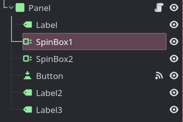

# 整活：狐狸彩票

这节整活来实现一个买彩票的小游戏，简单概括如下：

- 刚开始你有 1000 块钱
- 彩票售价 100 块
- 彩票下注需要两个数字，这两个数字都是个位数，不能是 0
- 猜中一个数奖金 300，猜中两个奖金 3000

玩起来大概这样：


## 场景创建

这个界面需要这么几个东西：

- 标题
- 两个数字输入框
- 一个购买按钮
- 一个显示结果的 label
- 一个显示钱包的 label

我创建的节点长这样：



## 逻辑分析

我们现在已经知道了游戏的逻辑，但是该如何将其转换成代码呢？

首先我们需要一个变量来保存钱包里的钱，并在按下购买按钮时对其进行判断，如果金钱足够则扣钱并进行买彩票的逻辑，如果金钱不足则显示钱不够。

所以我们可以得到这样一段伪代码：

```
当按下按钮时:
    if 钱包的钱足够买一张彩票:
        扣钱
        获取输入的两个数字
        随机抽取两个数
        判断随机数和输入的数字是否相等并以此产生奖金
        显示获奖结果
    else:
        显示“你的钱不够了！”
```

## 我的脚本编写参考

这里是我编写的代码，可以作为参考，你也可以尝试自己翻译一下上面的伪代码。

脚本放置在最外层的 Panel 节点上，然后绑定按钮的 `pressed` 信号。

界面布局和组件设置一类的操作我就不再讲解了，大家随意点击自己琢磨即可，没有什么特别难的地方。

代码：

```gdscript
extends Panel

var 钱包 := 1000

func _on_button_pressed():
    if 钱包 >= 100: # 看看有钱吗？
        # 先交钱
        钱包 -= 100
        $Label3.text = "钱包：" + str(钱包)

        # 获取下注的两个数字
        var 下注数a: int = $SpinBox1.value
        var 下注数b: int = $SpinBox2.value

        # 随机产生两个数字
        var 随机数a: int = randi_range(1, 9)
        var 随机数b: int = randi_range(1, 9)

        # 在消息 label 上显示随机产生的两个数，最后的 "\n" 表示换行。
        $Label2.text = str(随机数a) + ", " + str(随机数b) + "\n"

        # 判断两个数字是否赌对了
        var a赌对了: bool = 下注数a == 随机数a
        var b赌对了: bool = 下注数b == 随机数b

        # 根据两个数字的猜测结果加钱
        if a赌对了 and b赌对了:
            $Label2.text += "全猜对了！奖金 3000"
            钱包 += 3000
            $Label3.text = "钱包：" + str(钱包)
        elif a赌对了 or b赌对了:
            $Label2.text += "猜对一个，奖金 300"
            钱包 += 300
            $Label3.text = "钱包：" + str(钱包)
        else:
            $Label2.text += "你一分钱也没赚到"
    else: # 穷了
        $Label2.text = "你已经没钱下注了"
```

这里唯一一个陌生的东西就是 `randi_range` 了，它会根据括号里填入的数字生成一个随机整数，包含这两个数以及两数之间的数。

> 注意不要把钱包变量的定义放在方法里，否则每次点按钮都会创建一个新的钱包变量，逻辑就错了。
